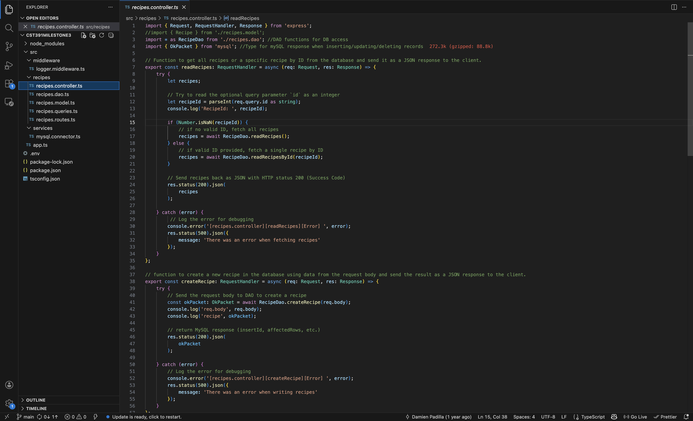
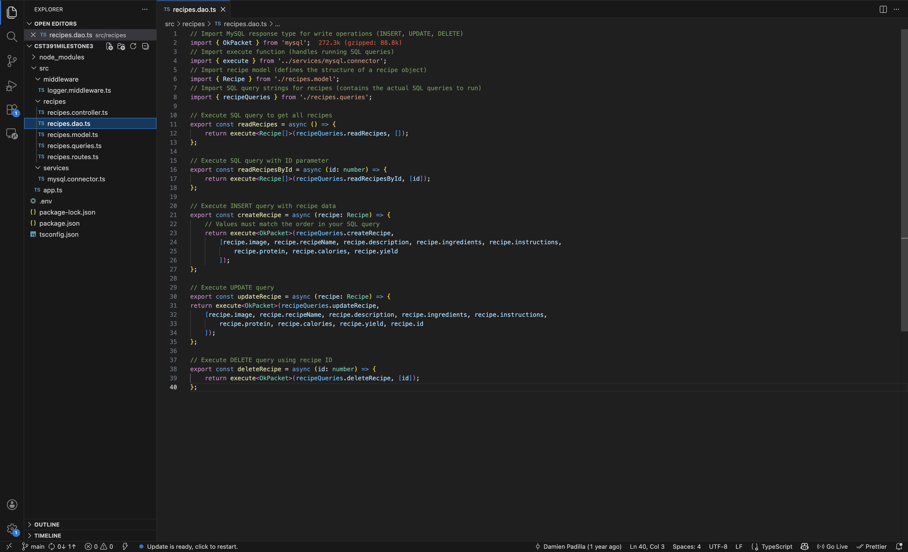
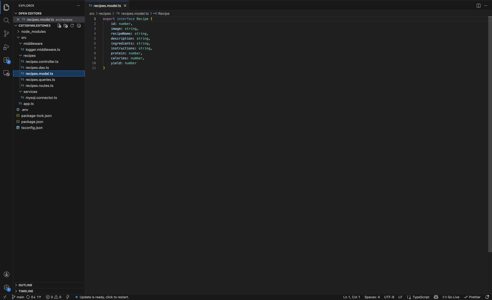
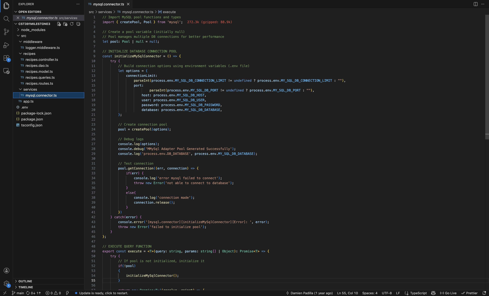
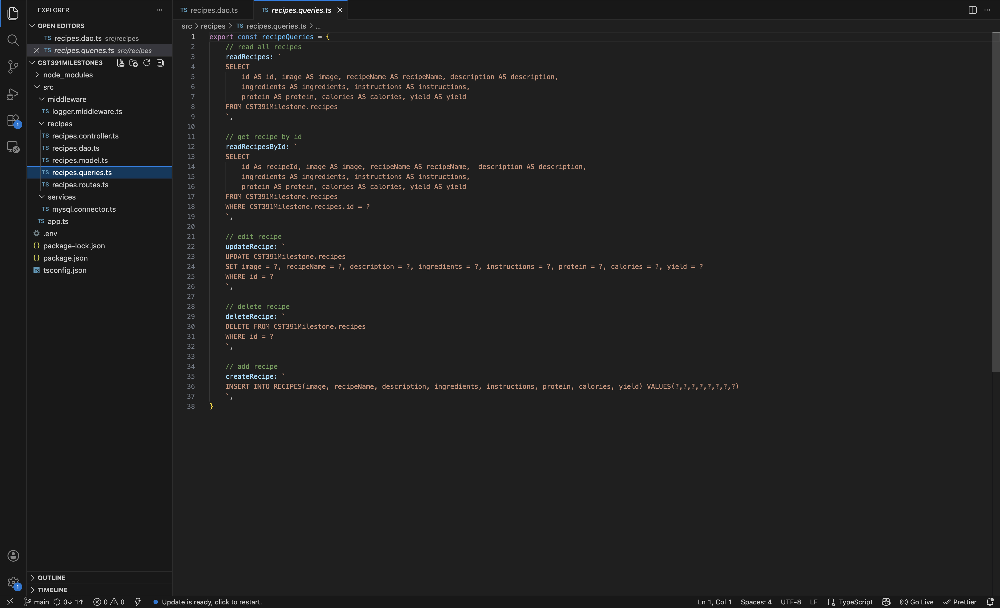
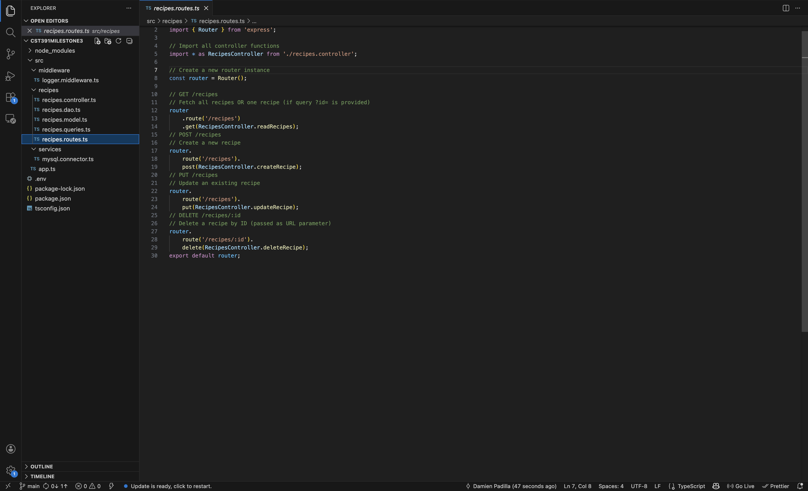

<h1 align="center">🛜 HealthyEats REST API</h3>

---

<h3>📌 Introduction</h3>

This project is a REST API built with TypeScript, Node.js, and Express that supports the HealthyEats React and Angular applications. It handles recipe data and allows users to create, view, update, and delete recipes while connecting the frontend apps to the backend.

---

<h3>✅ Functional Requirements</h3>

- Accept and process HTTP requests (GET, POST, PUT, DELETE).
- Return data in JSON format to the frontend applications.
- Connect and communicate with both React and Angular applications.
- Handle incoming data and store recipe information.
- Route requests to the correct endpoints.

---

<h3>🛠 Technologies Used</h3>

| Tech               | Purpose                                                           |
| ------------------ | ----------------------------------------------------------------- |
| Typescript         | Used to build the API with type safety and better code structure  |
| Node.js / Express  | Backend runtime and framework for the REST API                    |

---

<h3>🧰 Code Snippets </h3>
---
  

      
      
      
      
      
      
      
  

